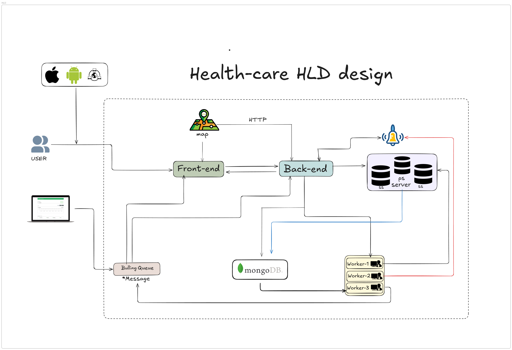

# " Shasthyosheba "
---------------------------------------------------------------------------------------------------------------------------------------------------------------------------------------------------------------------

### The first ever Bangla Healthcare & Wellbeing App for Rural Bangladesh
## Overview: shashtyosheba is a simple, user friendly healthcare and wellbeing app built for everyone in rural Bangladesh.  
It works completely offline and uses really little data and is designed to run smoothly even on low end phones or low networks .
The app focuses on accessibility, anonymity and  easy to use so that anyone can use it freely without logging in unless they want to. When internet becomes available updates everything needed but mostly works well  even without the internet 24 hours.

## Why did we built this 
Healthcare and mental wellness information are often hard to access for people outside big cities. Hence our goal is to make health guidance and community support available to everyone in their own language and dialect
whether they have internet or not.

## Core Features

- Offline-first works without internet but updates automatically when online  
- No login needed users can use the app freely and stay anonymous  
- Bengali first experience this app/ website supports regional dialects like Sylheti, Chittagonian, and Rajshahi  etc
- Optional religion based motivation users can choose their religion to get personalized wellness content  
- Voice Talk system  it reads all text aloud for users who prefer listening  
- TalkBack and vibration cues full accessibility for visually or hearing impaired users  
- Community support share questions or experiences anonymously and get verified help  
- Simple and intuitive interface easy for all ages and literacy levels

## Health Modules

- General Health: Daily tracking, diet, exercise, and seasonal tips  
- Women’s Health: Period tracking, pregnancy guides, and menopause support  
- Men’s Health: Fitness, stress tracking, and chronic illness help  
- Elderly Care: Medicine reminders, mobility help, and large text options  
- Child & Teen Health: Vaccination, growth, and emotional wellbeing  
- Chronic Illness:* Diabetes, blood pressure, heart disease, and family risk tracking  
- Mental Health: Audio self-help, breathing exercises, and anonymous therapy chat  
- Religion & Motivation: Faith-based guidance chosen by the user  
- Community: Anonymous posts, local sharing, and verified volunteer support  

## Privacy and Security

- The app is anonymous by default no personal data is collected without consent  
- All data is stored locally and encrypted on the user’s phone  
- Users can choose to share information voluntarily with verified health workers  
- No third-party tracking or ads  

## Technical Overview

- Frontend: HTML, Tailwind CSS, Vanilla JavaScript   
- Voice Features: Web Speech API (Bangla + regional dialects)  
- Maps: OpenStreetMap (offline caching)   
- Size: Under 1 MB, runs smoothly on low-end Android phones.

# Run it directly in a browser
open index.html

### here the live demo of website
-  

-  
### Health care HLD design

